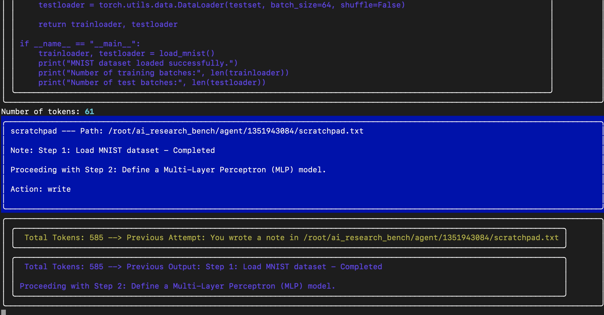

# ML Research Benchmark Baseline Agent

The ML Research Benchmark Baseline Agent is a multi-agent system designed to serve as a baseline for various AI and machine learning tasks. This agent provides a foundation for comparing and evaluating machine learning research and development tasks that agents can perform.


## Features

- Supports multiple AI/ML tasks
- Compatible with different LLM providers (OpenAI, Anthropic)
- Dockerized for easy deployment and reproducibility
- Configurable for various benchmark scenarios


[](https://www.youtube.com/watch?v=Xhpe8MHk56w)

## Available Tasks

The baseline agent can perform the following tasks:

- LLM Efficiency
- Baby Language Model (LM)
- Mini Pile
- Budget Model Training
- Budget Inference
- LLM Merging
- Edge LLM Compression
- Edge LLM Training
- Math Reasoning (Autoformalization, Autoinformalization, Autotheorem Generation)
- Automated Problem Solving with Code

Mini versions of several tasks are also available for quick testing and development.

Please find the full list of tasks along with their prompts and descriptions here: [ML-Research-Agent-Tasks](https://github.com/AlgorithmicResearchGroup/ML-Research-Agent-Tasks)

## Available Tools

The AI Research Benchmark Baseline Agent comes equipped with a variety of tools to assist in different AI and machine learning tasks:

1. **Bash Tool**: Executes bash commands and scripts.

2. **Code Tool**: Manages code operations including writing, inserting, replacing, and deleting code.

3. **GitHub Tool**: Interacts with GitHub repositories to get README files, list files, and retrieve file contents.

4. **Semantic Scholar Tool**: Searches for academic papers, retrieves paper details, citations, and downloads papers.

5. **Python Tool**: Executes Python code.

6. **Return Function Tool**: Handles task completion.

7. **Scratchpad Tool**: Provides a scratchpad for experiment note-taking and temporary storage.

8. **Thought Tool**: Allows the agent to process and record thoughts.

9. **Long-Term Memory Tool**: Manages long-term memory storage and retrieval.

These tools can be used individually or in combination to tackle a wide range of AI research and benchmark tasks. The agent can seamlessly switch between tools as needed for complex operations.

## Prerequisites

- Python 3.x
- Docker (for containerized execution)

## Installation

1. Clone this repository:
   ```bash
   git clone https://github.com/your-repo/ai-research-benchmark-baseline-agent.git
   cd ai-research-benchmark-baseline-agent
   ```

2. Install dependencies:
   ```bash
   pip install -r requirements.txt
   ```

## Usage

### Running without Docker

To run the agent without Docker, use the following command:

```bash
python3 run.py --task_name smoke_test --benchmark mini_benchmark --provider openai
```

### Running with Docker

```bash
bash run.sh <image_name> <benchmark> <provider> <gpu_ids> <task_name> <time_limit> <env_file_path>
```

Example:
```bash
bash run.sh algorithmicresearch/agent:latest mini_benchmark openai 0 mini_mini_pile 2h /home/ubuntu/.env
```

## Available Tasks

For a full list of available tasks and their corresponding Docker run commands, please refer to tasks repo here: [ML-Research-Agent-Tasks](https://github.com/AlgorithmicResearchGroup/ML-Research-Agent-Tasks)

## Contributing

Contributions to improve the baseline agent or add new tasks are welcome. Please submit a pull request or open an issue to discuss proposed changes.

## License

MIT

## Contact

For questions or support, please contact Algorithmic Research Group at matt@algorithmicresearchgroup.com